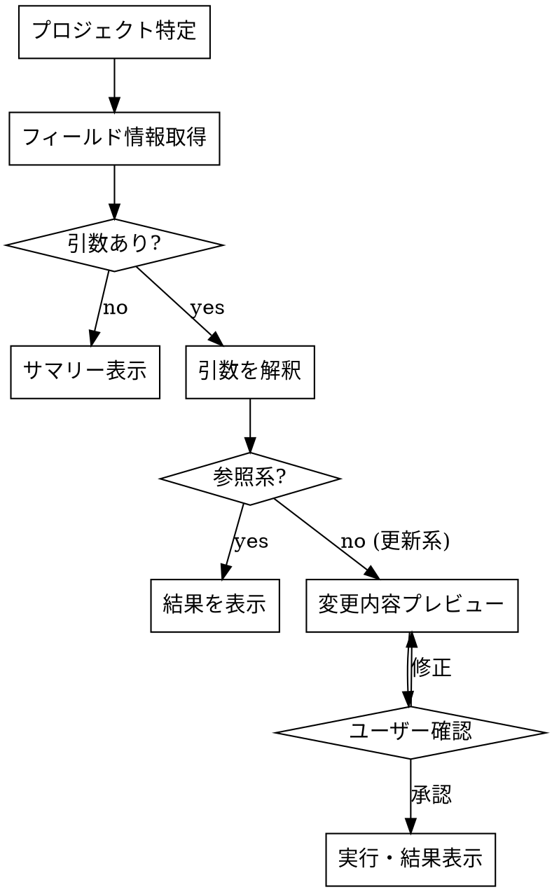

# gh-project

GitHub Projects を `gh project` CLI で操作するスキル。

## 処理フロー



## Step 1: プロジェクト特定

```bash
gh project list --owner "$(gh repo view --json owner -q .owner.login)" --format json
```

出力の `id` フィールドが `PROJECT_ID`（GraphQL ノード ID）、`number` がプロジェクト番号。

- 1 つ → 自動選択
- 複数 → 番号付きリストで提示し、ユーザーに番号で選ばせる
- 0 → エラー終了

## Step 2: フィールド情報取得

```bash
gh project field-list <NUMBER> --owner <OWNER> --format json
gh project item-list <NUMBER> --owner <OWNER> --format json
```

フィールド名・オプション値（Status, Priority, Size 等）を動的に取得する。ハードコード禁止。

## Step 3: 引数の解釈と実行

### 引数なし → サマリー表示

- Status ごとのアイテム数
- Priority の選択肢一覧のうち、先頭（最高優先度）のアイテムを一覧表示

### 参照系（確認なしで実行）

| パターン | 動作 |
|---------|------|
| `P0 一覧` / `P1 のアイテム` | Priority でフィルタして表示 |
| `Ready のアイテム` / `Backlog 一覧` | Status でフィルタして表示 |
| `フィールド一覧` | フィールド名とオプション値を表示 |
| `#14 の詳細` | 特定アイテムの全フィールドを表示 |

### 更新系（プレビュー → ユーザー確認 → 実行）

| パターン | 動作 |
|---------|------|
| `#14 を In progress に` | Status を変更 |
| `#7 の Size を M に` | フィールド値を変更 |
| `#20 を追加` | issue をプロジェクトに追加 |

更新系のプレビューでは以下を表示する:
- 対象アイテム: issue 番号とタイトル
- 変更内容: フィールド名、現在値 → 変更後の値

更新コマンド:

```bash
# ステータス・フィールド変更（PROJECT_ID は Step 1 で取得した GraphQL ノード ID）
gh project item-edit --project-id <PROJECT_ID> --id <ITEM_ID> --field-id <FIELD_ID> --single-select-option-id <OPTION_ID>

# アイテム追加
gh project item-add <NUMBER> --owner <OWNER> --url <ISSUE_URL>
```

## 表示フォーマット

テーブル形式で見やすく表示する。例:

```
| # | タイトル | Status | Priority | Size |
|---|---------|--------|----------|------|
| 14 | fix: コピーボタン追従 | Ready | P0 | XS |
```

## Rules

- フィールド名・オプション値は毎回 `gh project field-list` から動的に取得する
- 更新系の操作はユーザー確認なしに実行しない
- `gh project` の権限エラー（`missing required scopes` を含むメッセージ）が出た場合は `gh auth refresh -h github.com -s read:project -s project` の実行を案内する
- 出力は日本語（技術用語・識別子はそのまま）
